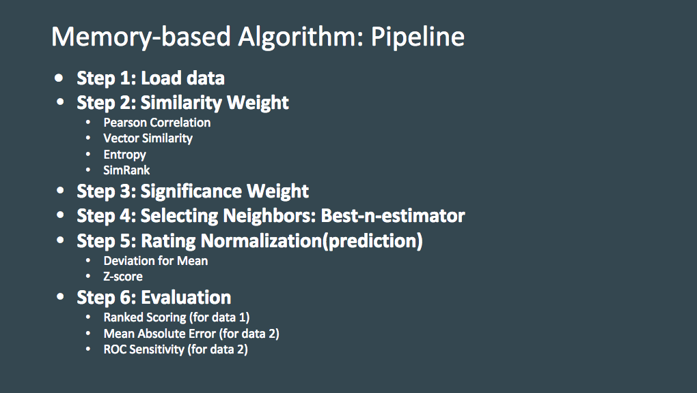
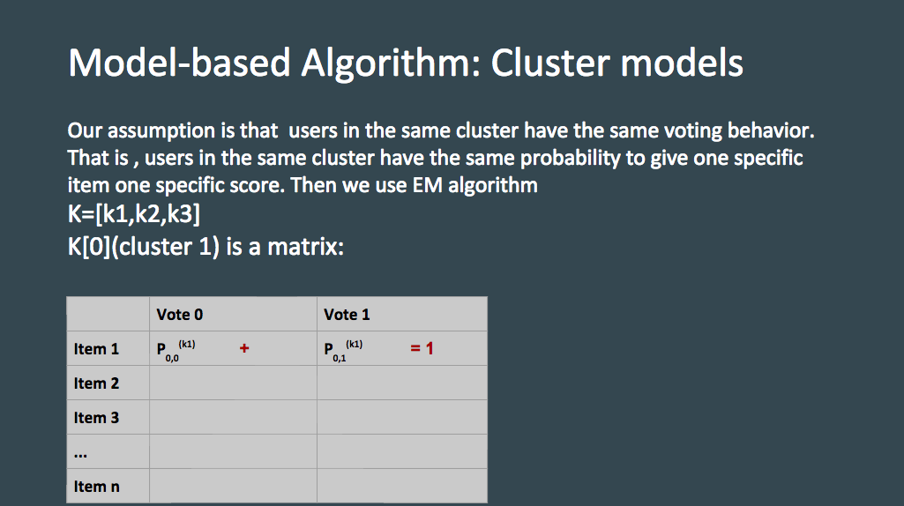
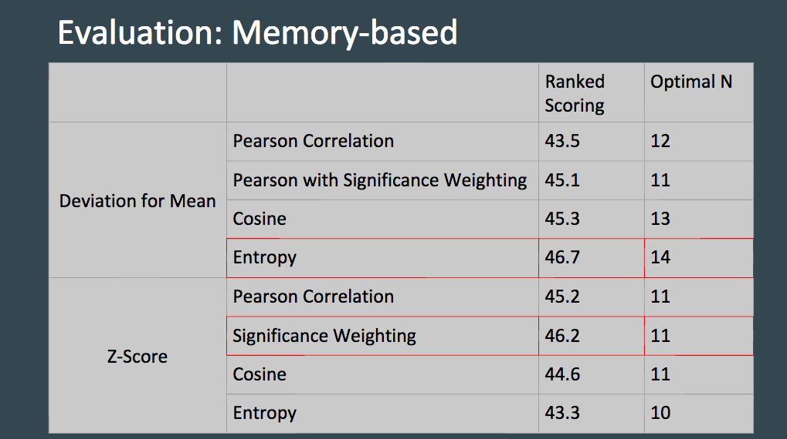
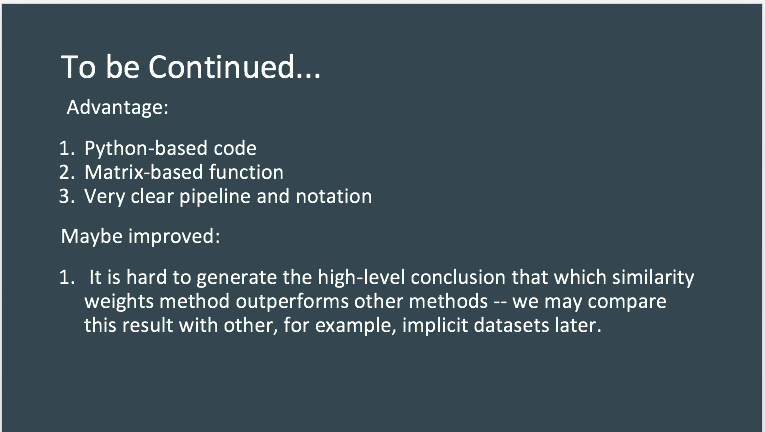

# Collaborative Filtering Algorithms Evaluation

### 1. Project Introduction
Collaborative filtering refers to the process of making automatic predictions (filtering) about the interests of a user by collecting preferences or taste information from many users (collaborating).

For this project, we used **a pair of algorithms** from the *Collaborative filtering* literature. We will study the algorithms carefully and implement them, from scratch. 

### 2. Project Discription 

#### 2.1 Datasets
Normally, there are two types of data: explicit voting (usually on a discrete numerical scale) and implicit voting (for example browsing data). In this project we used Movies Grading Data (explicit voting) and Anonymous Microsoft Web Data(implicit voting).

#### 2.2 Model Structure



Data set one is implicit voting and data set two is explicit voting. The prediction for both data sets is carried out by two methods, Deviation for Mean and Z_Score. For the first data set, we used Ranked Scoring for evaluation. And for the second data set, we used Mean Absolute Error and ROC Sensitivity for evaluation.

### 3. Conclusion

Generally Speaking, memory-based model is better than model based model (EM algorithm) 


	
Following [suggestions](http://nicercode.github.io/blog/2013-04-05-projects/) by [RICH FITZJOHN](http://nicercode.github.io/about/#Team) (@richfitz). This folder is orgarnized as follows.

```
proj/
├── lib/
├── data/
├── doc/
├── figs/
└── output/
```